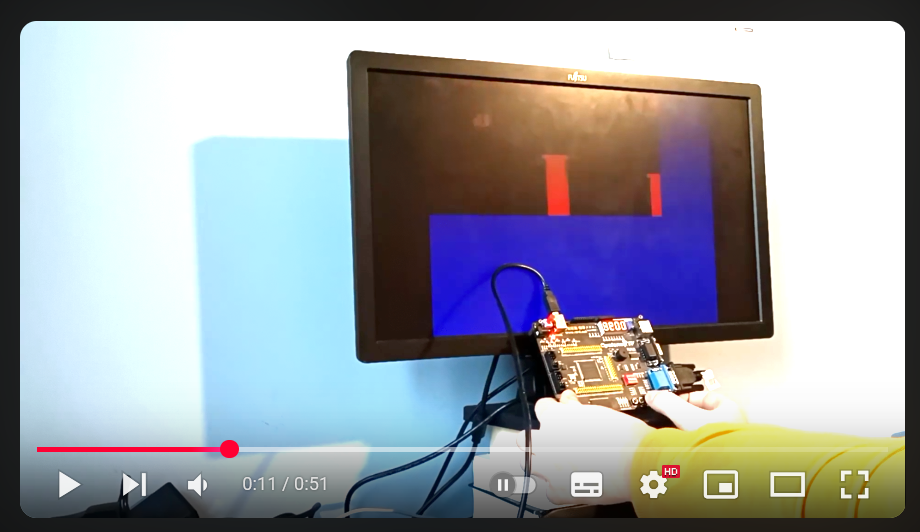

**This repo contains my implemetation of CHIP8:**
- [emulator](emulator)
- [fpga hradware implementation](fpga)
- [assembler](assembler)
- [flappy bird clone written in assembly](source.c8asm)

short video presentation:

**There you can read** [project summary](docs/summary.md)