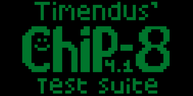
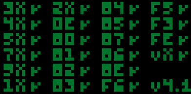
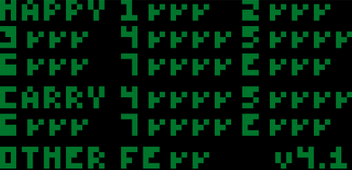
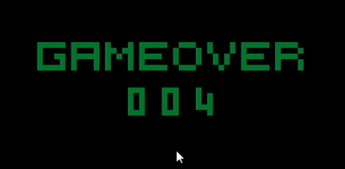
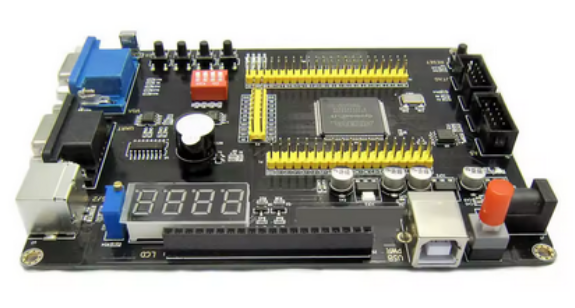
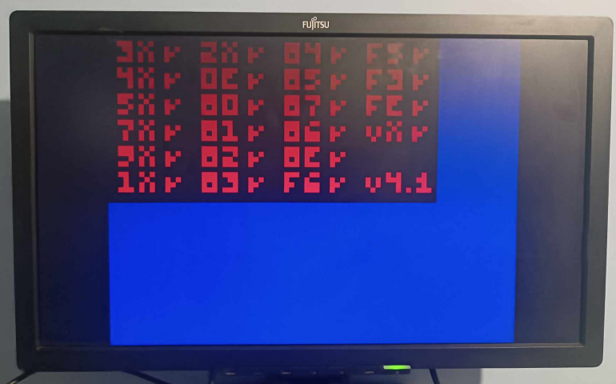
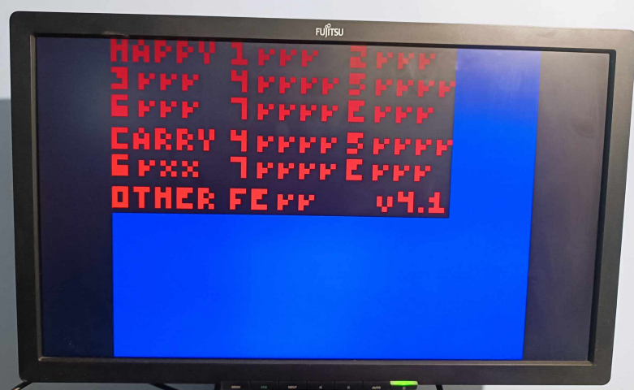
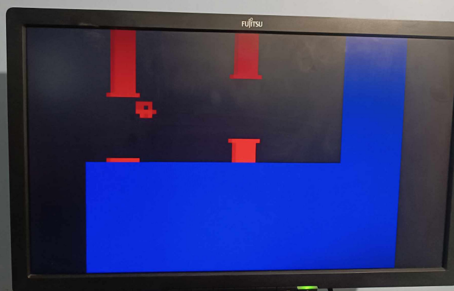

# CHIP8 project
Dominik “Qikcik” Rudnik 

short video presentation:
[](https://www.youtube.com/watch?v=K1BQPlGRoo8)

## Introduction
**Project goal was to:**
- Implement one of the simplest ISA using VHDL without any mechanism like pipelining, cache, branch prediction etc.
- Create an interpreter for that ISA
- Create the simplest Assembler for that ISA, even without any compile time execution (like addition of constants/literals)
- Create a program/game for that platform

I decided to implement a CHIP8. Depending on the source it is called a specification of  ISA, a virtual machine,an interpreter or a programming language.

**CHIP8 contains:**
- 16x  general purpose 8-bit registers (the last one is used to store flags of operations) (REG_X)
- 16-bit register used to store memory address (I)
- 16-bit  program counter register (PC)
- 8-bit   stack pointer register (stack is limited to 16x16bit)
- 2x  8-bit registers (one for counting delay, and one for counting sound time)
- ISA with 35 opcodes.
- 16-key keypad (0,1,2,3,4,5,6,7,8,9,0,A,B,C,D,E,F)
- 64x32-pixel monochrome display (draw opcode is doing xor at pixels and sets collision flag, when overdrive a pixel - which is important in implementing games)

As a specification I used http://devernay.free.fr/hacks/chip8/C8TECH10.HTM

At the beginning I just want to mention that I made this project for pure education purpose, and it is not in production ready state.
There is some of commented code, of not optimal solutions and of dirty fast hacks.
I wanted only to understand crucial concepts and big picture of "computer system".


## Implementing emulator

I wanted to focus on opcode implementation in pure details and avoid abstractions layers. That is why, I decided to use C. 
I separated CHIP8 implementation from interaction platform specific code (like drawing, handling input).

There is content of [[chip8.h](../emulator/sources/chip8.h)}:
```c++
struct Chip8;
typedef struct Chip8 Chip8;

Chip8* chip8_allocate();
void chip8_initialize(Chip8*);
void chip8_deallocate(Chip8*);

void chip8_loadProgramFromPath(Chip8*,char*);
void chip8_preformNextInstruction(Chip8*);

void chip8_fixedUpdate(Chip8*);

void chip8_setKeyPressed(Chip8*, uint8_t, bool);

uint8_t chip8_getPixel(Chip8*,int x,int y);
bool chip8_getBuzzer(Chip8*);
```

Let's deep dive into some concepts. 
Decoding and execution of instruction is done in the deadly simplest way, that I know.


At the beginning There is fetching 2 bytes (PC and PC+1) {[chip8.h](../emulator/sources/chip8.h)}
```c++
uint16_t fetch_opcode(Chip8* c) {
    const uint8_t ms = c->memory[c->pc_reg];
    const uint8_t ls = c->memory[c->pc_reg + 1];
    c->pc_reg += 2;
    if(c->pc_reg > MEMORY_SIZE-1) c->pc_reg = MEMORY_SIZE-1;
    return (ms << 8) | ls;
}
```


Then in one big if-else, There is the implementation of specific instruction: {[chip8.h](../emulator/sources/chip8.h)}
```c++
const uint16_t opcode = fetch_opcode(c);
if(DEBUG_PRINT) printf("at %x instruction %x: ",c->pc_reg-2,opcode);

if(opcode == 0x00E0) { // 00E0 - CLS
    if(DEBUG_PRINT) printf("display_clear()");
    for(int Yidx = 0; Yidx != FRAMEBUFFER_Y; Yidx++)
        for(int Xidx = 0; Xidx != FRAMEBUFFER_X; Xidx++)
            c->screen[Yidx][Xidx] = 0;
}
else if((opcode & 0xF00F) == 0x8002) { // 8xy2 - AND Vx, Vy
    const uint8_t selectedRegX = (opcode & 0x0F00) >> 2*4;
    const uint8_t selectedRegY = (opcode & 0x00F0) >> 1*4;
    c->v_reg[selectedRegX] = c->v_reg[selectedRegX] & c->v_reg[selectedRegY];
    c->v_reg[GENERAL_REG_SIZE-1] = 0;
    if(DEBUG_PRINT) printf("V_%x &= %x", selectedRegX, selectedRegY);
}
else if((opcode & 0xF00F) == 0x8003) { // 8xy3 - XOR Vx, Vy
    const uint8_t selectedRegX = (opcode & 0x0F00) >> 2*4;
    const uint8_t selectedRegY = (opcode & 0x00F0) >> 1*4;
    c->v_reg[selectedRegX] = c->v_reg[selectedRegX] ^ c->v_reg[selectedRegY];
    c->v_reg[GENERAL_REG_SIZE-1] = 0;
    if(DEBUG_PRINT) printf("V_%x ^= %x", selectedRegX, selectedRegY);
}
else if((opcode & 0xF00F) == 0x8004) { // 8xy4 - ADD Vx, Vy
    const uint8_t selectedRegX = (opcode & 0x0F00) >> 2*4;
    const uint8_t selectedRegY = (opcode & 0x00F0) >> 1*4;
    const uint16_t sum = c->v_reg[selectedRegX] + c->v_reg[selectedRegY];
    c->v_reg[selectedRegX] = sum;
    c->v_reg[GENERAL_REG_SIZE-1] = (sum > 255);
    if(DEBUG_PRINT) printf("V_%x += %x", selectedRegX, selectedRegY);
}
```

The most crucial concept is how to describe opcode layout, and where in it there are arguments.
Below description of that one used by me from http://devernay.free.fr/hacks/chip8/C8TECH10.HTM
```
nnn or addr - A 12-bit value, the lowest 12 bits of the instruction
n or nibble - A 4-bit value, the lowest 4 bits of the instruction
x - A 4-bit value, the lower 4 bits of the high byte of the instruction
y - A 4-bit value, the upper 4 bits of the low byte of the instruction
kk or byte - An 8-bit value, the lowest 8 bits of the instruction
```

I want to mention Drawing instruction, because it is one of the most complex instruction.
Below there is description from http://devernay.free.fr/hacks/chip8/C8TECH10.HTM
```
Dxyn - DRW Vx, Vy, nibble
Display n-byte sprite starting at memory location I at (Vx, Vy), set VF = collision.
The interpreter reads n bytes from memory, starting at the address stored in I. These bytes are then displayed as sprites on screen at coordinates (Vx, Vy). Sprites are XORed onto the existing screen. If this causes any pixels to be erased, VF is set to 1, otherwise it is set to 0. If the sprite is positioned so part of it is outside the coordinates of the display, it wraps around to the opposite side of the screen. See instruction 8xy3 for more information on XOR, and section 2.4, Display, for more information on the Chip-8 screen and sprites.
```

And there is my current implementation of draw instruction: 
```c++
else if((opcode & 0xF000) == 0xD000) { // Dxyn - DRW Vx, Vy, nibble
    uint8_t target_v_reg_x = (opcode & 0x0F00) >> 8;
    uint8_t target_v_reg_y = (opcode & 0x00F0) >> 4;
    uint8_t sprite_height = opcode & 0x000F;
    uint8_t x_location = c->v_reg[target_v_reg_x] & FRAMEBUFFER_X-1;
    uint8_t y_location = c->v_reg[target_v_reg_y] & FRAMEBUFFER_Y-1;
    uint8_t pixel;

    if( c->tickFromFixedUpdate == 0) {
        // Reset collision register to FALSE
        c->v_reg[0xF] = 0;
        for (int y_coordinate = 0; y_coordinate < sprite_height && (y_location+y_coordinate) < FRAMEBUFFER_Y ; y_coordinate++) {
            pixel = c->memory[c->i_reg + y_coordinate];
            for (int x_coordinate = 0; x_coordinate < 8  && (x_location+x_coordinate) < FRAMEBUFFER_X ; x_coordinate++) {
                if ( pixel & (0x80 >> x_coordinate) ) {
                    if (c->screen[y_location + y_coordinate][x_location + x_coordinate] == 1) {
                        c->v_reg[0xF] = 1;
                    }
                    c->screen[y_location + y_coordinate][x_location + x_coordinate] ^= 1;
                }
            }
        }
        if (DEBUG_PRINT) printf("draw(V_%x,V_%x,%x)", target_v_reg_x, target_v_reg_y, sprite_height);
    }
    else {
        c->pc_reg -= 2;
        if (DEBUG_PRINT) printf("draw(V_%x,V_%x,%x) - wait for vsync", target_v_reg_x, target_v_reg_y, sprite_height);
    }
}
```

During development as a test suite, I used this test program https://github.com/Timendus/chip8-test-suite

There are some final screenshot:

 
 

My implementation is far from perfect, It doesn't even have unit tests.
Thanks to it, I got used to opcodes at least a little bit.

## Implementing Assembler

This time I used C++, because it is more flexible and U was able to use more functional style paradigm,
my Assembly notation is a variant from "Cowgod's Chip-8 Technical Reference v1.0 opcode" description.

The first step in my implementation of assembling is TokenIterator. It scans source code and create tokens like: 
- literals (ld, loop_xxx),
- "strings",
- numbers (2,0b01,0xFF),
- operators (*,:,;)

Below some code snippets {[tokenIterator.hpp](../assembler/source/tokenIterator.hpp)}
```c++
namespace Token
{
    struct Base {
        int line {};
    };

    template<typename T>
    struct WithValue : public Base
    {
        T value;
    };

    struct End      : public Base {};
    struct Operator : public WithValue<std::string> {};
    struct Label    : public WithValue<std::string> {};
    struct String   : public WithValue<std::string> {};
    struct Number   : public WithValue<int> {};

    using type = std::variant<End,Operator,Label,String,Number>;
}

std::ostream& operator<<(std::ostream& os, const Token::type& in);

class TokenIterator
{
public:
    explicit TokenIterator(const std::string& inSource);

    void addOperator(const std::string& in_value);

    const Token::type& next();
    const Token::type& current();
    
    //...
};
```
```c++
TokenIterator it(source);
it.addOperator(":");
it.addOperator(";");
it.addOperator("+");
it.addOperator("*");

std::vector<Token::type> tokens {};
int consumedIndex = 0;

while(!std::holds_alternative<Token::End>(it.next()))
{
    tokens.push_back(it.current());
}
```

The next step is translating that tokens into binary representation of opcode.

My implementation have single array with all opcode. Each one opcode contains list of TokenMatcher functions.

If all of them are fulfilled in sequence, the corresponding OutputGenerator produced bytes. {[main.cpp](../assembler/source/main.cpp)}
```c++
std::vector<OpCode> opcodes = {
    OpCode{{ExactOperator(";"),Any()}, [](auto a, auto b, auto c){} },
    OpCode{ {ExactOperator(":"), AnyLabel()}, RegisterAddress() },
    OpCode{{ExactLabel("db"),AnyNumber()}, ByteOutput() },

    OpCode{{ExactLabel("cls")}, CCCCOutput(0x00E0) },
    OpCode{{ExactLabel("ret")}, CCCCOutput(0x00EE) },
    OpCode{{ExactLabel("sys"), AnyNumberOrLabel()}, CNNNOutput(0x0000,1) },
    OpCode{{ExactLabel("call"), AnyNumberOrLabel()}, CNNNOutput(0x2000,1) },
    OpCode{{ExactLabel("se"), AnyGenericReg(), AnyNumber()}, CXKKOutput(0x3000) },
    OpCode{{ExactLabel("sne"), AnyGenericReg(), AnyNumber()}, CXKKOutput(0x4000) },
    OpCode{{ExactLabel("se"), AnyGenericReg(), AnyGenericReg()}, CXYCOutput(0x5000) },
    OpCode{{ExactLabel("ld"), AnyGenericReg(), AnyNumber()}, CXKKOutput(0x6000) },
    OpCode{{ExactLabel("add"), AnyGenericReg(), AnyNumber()}, CXKKOutput(0x7000) },
    OpCode{{ExactLabel("ld"), AnyGenericReg(), AnyGenericReg()}, CXYCOutput(0x8000) },
    OpCode{{ExactLabel("or"), AnyGenericReg(), AnyGenericReg()}, CXYCOutput(0x8001) },
    OpCode{{ExactLabel("and"), AnyGenericReg(), AnyGenericReg()}, CXYCOutput(0x8002) },
    OpCode{{ExactLabel("xor"), AnyGenericReg(), AnyGenericReg()}, CXYCOutput(0x8003) },
    OpCode{{ExactLabel("add"), AnyGenericReg(), AnyGenericReg()}, CXYCOutput(0x8004) },
    OpCode{{ExactLabel("sub"), AnyGenericReg(), AnyGenericReg()}, CXYCOutput(0x8005) },
    OpCode{{ExactLabel("shr"), AnyGenericReg(), AnyGenericReg()}, CXYCOutput(0x8006) },
    OpCode{{ExactLabel("subn"), AnyGenericReg(), AnyGenericReg()}, CXYCOutput(0x8007) },
    OpCode{{ExactLabel("shl"), AnyGenericReg(), AnyGenericReg()}, CXYCOutput(0x800E) },
    OpCode{{ExactLabel("sne"), AnyGenericReg(), AnyGenericReg()}, CXYCOutput(0x9000) },

    OpCode{{ExactLabel("jp"), ExactLabel("reg0"),ExactOperator("+"),AnyNumberOrLabel()}, CNNNOutput(0xB000,3) },
    OpCode{{ExactLabel("jp"), AnyNumberOrLabel()}, CNNNOutput(0x1000,1) },

    OpCode{{ExactLabel("rnd"), AnyGenericReg(), AnyNumber()}, CXKKOutput(0xC000) },
    OpCode{{ExactLabel("drw"), AnyGenericReg(),AnyGenericReg(), AnyNumber()}, CXYNOutput(0xD000) },

    OpCode{{ExactLabel("skp"), AnyGenericReg()}, CXCCOutput( 0xE09E,1 ) },
    OpCode{{ExactLabel("sknp"), AnyGenericReg()}, CXCCOutput( 0xE0A1,1 ) },
    OpCode{{ExactLabel("ld"), AnyGenericReg(),ExactLabel("delayTimer")}, CXCCOutput( 0xF007,1 ) },
    OpCode{{ExactLabel("ld"), AnyGenericReg(),ExactLabel("keyPress")}, CXCCOutput( 0xF00A,1) },

    OpCode{{ExactLabel("ld"), ExactLabel("delayTimer"),AnyGenericReg()}, CXCCOutput( 0xF015,2 ) },
    OpCode{{ExactLabel("ld"), ExactLabel("soundTimer"),AnyGenericReg()}, CXCCOutput( 0xF018,2 ) },

    OpCode{{ExactLabel("add"), ExactLabel("regI"),AnyGenericReg()}, CXCCOutput( 0xF01E, 2 ) },
    OpCode{{ExactLabel("ld"), ExactLabel("regI"),ExactLabel("spriteOf"),AnyGenericReg()}, CXCCOutput( 0xF029,3) },
    OpCode{{ExactLabel("ld"), ExactLabel("regI"),AnyNumberOrLabel()}, CNNNOutput(0xA000,2) },
    OpCode{{ExactLabel("ld"), ExactOperator("*"),ExactLabel("regI"),ExactLabel("bcdOf"),AnyGenericReg()}, CXCCOutput( 0xF033,4 ) },
    OpCode{{ExactLabel("ld"), ExactOperator("*"),ExactLabel("regI"),ExactLabel("upTo"), AnyGenericReg()}, CXCCOutput( 0xF055,4 ) },
    OpCode{{ExactLabel("ld"), ExactLabel("upTo"), AnyGenericReg(), ExactOperator("*"),ExactLabel("regI")}, CXCCOutput( 0xF065,2 ) }
};
```

a few TokenMatcher generators as example: 
```c++
using TokenMatcher = std::function<bool(Token::type&)>;
//...

auto AnyLabel = []() -> TokenMatcher  {
    return [](Token::type& t) -> bool {
        if (const auto* typedToken = std::get_if<Token::Label>(&t)) {
            return true;
        }
        return false;
    };
};

auto ExactOperator = [](std::string param) -> TokenMatcher  {
    return [param](Token::type& t) -> bool {
        if (const auto* typedToken = std::get_if<Token::Operator>(&t)) {
            return typedToken->value == param;
        }
        return false;
    };
};

auto AnyNumberOrLabel = []() -> TokenMatcher  {
    return [](Token::type& t) -> bool {
        if (const auto* typedToken = std::get_if<Token::Label>(&t)) {
            return true;
        }
        if (const auto* typedToken = std::get_if<Token::Number>(&t)) {
            return true;
        }
        return false;
    };
};
```

a few OutputGenerator generators as example:
```c++
using OutputGenerator = std::function<void(Context& context, std::vector<Token::type>, size_t startIdx)>;
//...

auto CXYNOutput = [](uint16_t param) -> OutputGenerator  {

    return [param](Context& context, const std::vector<Token::type>& tokens, size_t startIdx) {

        int x {};
        int y {};
        int n {};

        if (const auto* typedToken = std::get_if<Token::Label>(&tokens[startIdx+1])) {
            x = getRegNum(typedToken->value);
        }
        if (const auto* typedToken = std::get_if<Token::Label>(&tokens[startIdx+2])) {
            y = getRegNum(typedToken->value);
        }
        if (const auto* typedToken = std::get_if<Token::Number>(&tokens[startIdx+3])) {
            n = typedToken->value;
        }

        int opcode = param | (uint8_t(x) & 0b1111) << 2 * 4 | (uint8_t(y) & 0b1111) << 1 * 4 | (uint8_t(n) & 0b1111) << 0 * 4;

        context.push(opcode);
    };
};

auto RegisterAddress = []() -> OutputGenerator  {
    return [](Context& context, const std::vector<Token::type>& tokens, size_t startIdx) {
        if (const auto* typedToken = std::get_if<Token::Label>(&tokens[startIdx+1])) {
            if( context.addrRefs[typedToken->value].targetLocation != -1 )
            {
                std::cout << "redefinition of label: " << typedToken->value << std::endl;
                exit(-1);
            }
            context.addrRefs[typedToken->value].targetLocation = 0x200 + context.output.size();
            return;
        }

        exit(-1);
    };
};
```

One of the main cons of this approach is that it is a single pass.
So after generating output, correct address must be putted in specific place based on special map.
Similar to how the standard linker works.

```c++
struct Context
{
    std::vector<uint8_t> output;
    //...

    struct addrRef {
        int targetLocation {-1};
        std::vector<int> addressToPut {};
    };

    std::map<std::string,addrRef> addrRefs {};
};


//...
std::cout << "linking symbols" << std::endl;
for(auto pairIt : context.addrRefs) {
    if(pairIt.second.targetLocation == -1) {
        std::cout << "symbol " << pairIt.first << " was used, but not defined";
        return -1;
    }
    for(auto it : pairIt.second.addressToPut) {
        context.output[it] = (context.output[it] & 0b11110000) | pairIt.second.targetLocation >> 2 * 4 & 0b1111;
        context.output[it+1] = pairIt.second.targetLocation;
    }
}
```

This architecture allowed me to fastly iterate over opcodes implementation and reusing code.
In parallel to creating assembly and that assembler I created a game. That's why all the code examples are in the next chapter.  


## Creating the Game

I decided to create flappy bird clone as example game, below screenshot from emulator:

 

Below there are some code snippets. I hope that all of them are self-explanatory based on similarity to "standard" assembly: {[source.c8asm](../source.c8asm)}
```asm 
jp CODE

;"reg9 is reserved for score!"

:CONSTANS
    :sprite_bird
        db 0b01110000
        db 0b11010000
        db 0b11111000
        db 0b11110000

    :sprite_bird_accelerate
        db 0b11110000
        db 0b11010000
        db 0b11111000
        db 0b01110000

;"..."

:VARIABLES
    :v_bird
        db 12   ;"x"
        db 12   ;"y"
        db 0    ;"acceleration"
    :v_pipe_arr
        :v_pipe_0
            db 60   ;"x"
            db 10   ;"top pipeend"
            db 16   ;"pipe window"
        :v_pipe_1
            db 30   ;"x"
            db 15   ;"top pipeend"
            db 16   ;"pipe window"
  
;"..."

:CODE
    ;"init bird"
    ld reg0 12
    ld reg1 12
    ld reg2 0
    ld regI v_bird
    ld *regI upTo reg2

    ld reg0 60   ;"x"
    ld reg1 10   ;"top pipeend"
    ld reg2 16   ;"pipe window"
    ld reg3 30   ;"x"
    ld reg4 15   ;"top pipeend"

;"..."

:GAME
    ;"wait until delayTimer == 0"
    :main_delay
        ld reg15 delayTimer
        se reg15 0
            jp main_delay

    ;"set delayTime"
    ld reg15 2
    ld delayTimer reg15

    cls

    ;"------------------"
    ;"iterate over pipes"

    ld reg11 0 ;"counter"
    :loop_iterate_begin
        ;"regI := v_pipe_arr[reg11]"
        ld regI v_pipe_arr
        add regI reg11

        ;"load pipe struct"
        ld upTo reg2 *regI

        ;"move pipe"
        ld reg10 1
        sub reg0 reg10

        ;"regenerate pipe"
        se reg0 0
            jp end_regenerate_pipe

            rnd reg1 14
            add reg1 1 ;"range 1-15"
            ld reg0 63

            add reg9 1 ;"score"

        :end_regenerate_pipe
             
;"..."

        ;"draw top_pipe part"
        
;"..."

        ;"draw bottom"
        ld reg3 reg1 ;"temp y"
        add reg3 reg2

        ld regI sprite_pipe
        drw reg0 reg3 15

        ;"regI := v_pipe_arr[reg11]"
        ld regI v_pipe_0
        add regI reg11

        ;"save pipe struct"
        ld *regI upTo reg2

        ;"loop pipes"
        add reg11 3
        se reg11 6 ;"each pipe is 3bite long"
            jp loop_iterate_begin
            
;"..."

    ;"--------------------------------"
    ;"load bird struct"
    ld regI v_bird
    ld upTo reg2 *regI

    ;"check if jump"
    ld reg10 0x01
    sknp reg10
        ld reg2 2 ;"set acceleration to 3"

    ;"update y positon"
    sne reg2 0  jp bird_fall
        sub reg1 reg2
        se reg15 1 ;"screen boundry overflow"
            ld reg1 0

        ;"update acceleration"
        ld reg10 1
        sub reg2 reg10
        se reg15 1 ;"substract overflow"
            ld reg2 0

        jp bird_fall_end
    : bird_fall
        add reg1 1
        sne reg1 29 ;"screen boundry overflow"
            ld reg1 28
    : bird_fall_end

    ;"draw bird"
    ld regI sprite_bird
    se reg2 0
        ld regI sprite_bird_accelerate

    drw reg0 reg1 4
    sne reg15 1
        jp GAMEOVER

    ;"save bird struct"
    ld regI v_bird
    ld *regI upTo reg2

    jp GAME
    
;"..."

: GAMEOVER

    cls

    ld reg0 8
    ld reg1 8

    ld regI sprite_G
    drw reg0 reg1 5
    add reg0 6

;"..."
    ; "print score"
    ld regI v_bcd_store
    ld *regI bcdOf reg9

    ld upTo reg2 *regI


    ld reg3 16
    ld reg4 24

    ld regI spriteOf reg0
    drw reg4 reg3 5
    add reg4 6
    ld regI spriteOf reg1
    drw reg4 reg3 5
    add reg4 6
    ld regI spriteOf reg2
    drw reg4 reg3 5
    add reg4 6
    
    
    ld reg15 30
    ld delayTimer reg15

    :gameover_delay
        ld reg15 delayTimer
        se reg15 0
            jp gameover_delay

    ld reg15 keyPress

jp CODE
```

The most interesting section is “Self Modificable Code”,
Due to the fact that draw opcodes have sprite height as constant.
```
Dxyn - DRW Vx, Vy, nibble
Display n-byte sprite starting at memory location I at (Vx, Vy), set VF = collision.
```
This was a problem in drawing "pipe", because they height is randomized.
I created code that overwrite DRW instruction opcode, so I could easily use dynamic height from a register.

```asm
    ;"draw top_pipe part"
    ;"SELF MODIFICABLE CODE"

        ;"copy reg 0 to reg4"
        ld reg4 reg0

        ld reg0 reg1
        
        ld reg3 0x0F    
        and reg0 reg3
        
        ld reg3 0x30    
        or reg0 reg3

        ld regI drwTop
        add regI reg10 ;"ofset to second byte"
        ld *regI upTo reg0 ;"replace second byte"

        ;"revert reg 0"
        ld reg0 reg4

        ld regI sprite_pipe
        add regI reg10
        ld reg3 0
        :drwTop
            drw reg0 reg1 0x1 ;"reg3 and 0xF will be replaced"

        ld regI sprite_pipe
        drw reg0 reg1 0x1 
```

## Implementing Hardware Implementation
As development board I used Altera RZ-EasyFPGA A2.2 with Altera Cyclone EP4CE8E22N8N



One of the most reused entity is ClockDivider. I think that name is self-explanatory. {[clockDivider.vhd](../fpga/clockDivider.vhd)}
```vhdl
entity clockDivider is
	generic(
		inClock_speed 	: integer	:= 50_000_000;
		outClock_speed	: integer	:= 50_000_000
	);
	port(
		in_clk			: in std_logic 	:= '0';
		out_clk			: out std_logic	:= '0'
	);
end entity clockDivider;
```

For debug purpose I created  simple controller for 4x7segment display which is on the board.  {[disp4x7Seg_Types.vhd](../fpga/disp4x7Seg_Types.vhd)/[disp4x7Seg.vhd](../fpga/disp4x7Seg.vhd)}
```vhdl

package Disp4x7Seg_Types is
	type Array4x7Seg is array(3 downto 0) of  std_logic_vector(7 downto 0);
	
	constant CONST7SEG_EMPTY 	: std_logic_vector(7 downto 0) 	:= "00000000";
	constant CONST7SEG_DOT 		: std_logic_vector(7 downto 0) 	:= "00000001";
	
	constant CONST7SEG_0 : std_logic_vector(7 downto 0) := "11111100";
	constant CONST7SEG_1 : std_logic_vector(7 downto 0) := "01100000";
	--...
	constant CONST7SEG_H : std_logic_vector(7 downto 0) := "01101110";
	constant CONST7SEG_J : std_logic_vector(7 downto 0) := "11111000";
	--...
	
    function BinTo7SegHex(inBin : std_logic_vector(3 downto 0)) 
		return std_logic_vector; 
end package Disp4x7Seg_Types;
	
entity Disp4x7Seg is
	port (
		in_clk					: in std_logic;
		in_7seg 					: in Array4x7Seg;
		out_7seg 				: out std_logic_vector(7 downto 0) 	:= (others => '0');
		out_7segDigitSelect 	: out std_logic_vector(3 downto 0) 	:= (others => '0')
	);
end Disp4x7Seg;
```

And separated component that hides details about generating VGA signal. 
At the moment of writing ths doc, this seems to me to be a little mistake as it should more integrated which VRAM. {[vgaGenerator.vhd](../fpga/vgaGenerator.vhd)}
```vhdl
entity VgaGenerator is
	generic (
		clkFreq					: integer := 50_000_000;
		pixelFreq				: integer := 25_175_000;
		 
		hSync_visibleArea		: integer := 640;
		hSync_frontPorch    	: integer := 16;
		hSync_syncPulse		: integer := 96;
		hSync_backPorch     	: integer := 48;
		 
		vSync_visibleArea		: integer := 480;
		vSync_frontPorch    	: integer := 11;
		vSync_syncPulse		: integer := 2;
		vSync_backPorch     	: integer := 31
	);
	port (
		in_clk					: in  std_logic := '0';
		
		out_vgaRGB				: out std_logic_vector(2 downto 0) := (others => '0');
		out_vgaHSync			: out std_logic := '0';
		out_vgaVSync			: out std_logic := '0';

		out_isDisplaying		: out std_logic := '0';
		out_hPos					: out integer := 0;
		out_vPos					: out integer := 0;
		in_vgaRGB				: in  std_logic_vector(2 downto 0) := (others => '0')
	);
end VgaGenerator;

--...

begin

	e_clockDivider: ClockDivider 
	generic map(
		inClock_speed 	=> clkFreq,
		outClock_speed => pixelFreq
	)
	port map(
		in_clk	=> in_clk,
		out_clk	=> clkEnabled
	);

	out_vgaHSync <= '1' when hCounter >= hSync_visibleArea + hSync_frontPorch
							  and  hCounter <  hSync_visibleArea + hSync_frontPorch + hSync_syncPulse else '0';
							  
	out_vgaVSync <= '1' when vCounter >= vSync_visibleArea + vSync_frontPorch
							  and  vCounter <  vSync_visibleArea + vSync_frontPorch + vSync_syncPulse else '0';
		

	out_isDisplaying 	<= '1' when (hCounter < hSync_visibleArea) and (vCounter < vSync_visibleArea) else '0';
	out_vgaRGB 	<= in_vgaRGB when (hCounter < hSync_visibleArea) and (vCounter < vSync_visibleArea)  else (others => '0');
	
	out_hPos <= hCounter when hCounter < wholeLine 	else -1;
	out_vPos <= vCounter when vCounter < wholeFrame else -1;


	process(in_clk,clkEnabled)
	begin 
		if rising_edge(clkEnabled) then
			if(hCounter < wholeLine-1) then    --horizontal counter (pixels)
				hCounter <= hCounter + 1;
			else
				hCounter <= 0;
				
				if(vCounter < wholeFrame-1) then  --veritcal counter (rows)
					vCounter <= vCounter + 1;
				else
					vCounter <= 0;
				end if;
				
			end if;
			
		end if;
	end process;
```

For RAM I generated 1 Port BRAM with a 12 bit size address, and 8 bit size values.
Using .milf file output I was able to simply put execution code, without making additional scripts.


For VRAM I generated 2 Port BRAM. one for “CPU” and one for “GPU”. 
BRAM contains a 5 bit size address, and 64 bit size values. This allows me to “query” one vertical line of pixels at once.

<br>

Execution is built around one big Finite State Machine, with additional delay which is used as a timer in communication with RAM and VRAM. 
That delay was also useful during development for debugging purpose.

Below FSM states:
```puml
@startuml

[*] --> TState_Fetch_Begin
TState_Fetch_Begin --> TState_Fetch_StoreFirstByte
TState_Fetch_StoreFirstByte --> TState_Fetch_StoreSecondByte
TState_Fetch_StoreSecondByte --> TState_Fetch_ParseAndInitOpcode

TState_Fetch_ParseAndInitOpcode --> TState_Cls
TState_Cls --> TState_Cls
TState_Cls --> [*]
TState_Fetch_ParseAndInitOpcode --> TState_Draw_ReadLine
TState_Draw_ReadLine --> TState_Draw_WriteLine
TState_Draw_WriteLine --> TState_Draw_Increment
TState_Draw_Increment --> TState_Draw_ReadLine
TState_Draw_Increment --> [*]

TState_Fetch_ParseAndInitOpcode --> TState_Return
TState_Return --> [*]
TState_Fetch_ParseAndInitOpcode --> TState_Call
TState_Call --> [*]
TState_Fetch_ParseAndInitOpcode --> TState_LoadReg_PrepareAddress
TState_LoadReg_PrepareAddress --> TState_LoadReg_Store
TState_LoadReg_Store --> [*]

TState_Fetch_ParseAndInitOpcode --> TState_SaveReg_PrepareAddress
TState_SaveReg_PrepareAddress   --> TState_SaveReg_Store

TState_Fetch_ParseAndInitOpcode --> TState_BCD1
TState_BCD1 --> TState_BCD2
TState_BCD2 --> [*]
@enduml
```

The most important states are Begin, StoreFirstByte, StoreSecondByte, ParseAndInitOpcode. 
They are used to fetch 2 bytes and combine them into instruction. 
And if specific opcode can be executed in single cycle, executing that opcode. {[entry.vhd](../fpga/entry.vhd)}
```vhdl
begin
    if rising_edge(in_clk_50mhz) then
        prev_keyPress <= keyPress;
        rnd_counter <= rnd_counter+1;
        if frame_counter >= integer( (real(1)/real(60)) / (real(1)/real(50_000_000)) ) then
            if reg_delay > 0 then
                reg_delay <= reg_delay -1;
            end if;
            frame_counter <= 0;
        else
            frame_counter <= frame_counter+1;
        end if;
    
        if currentState = nextState and nextState_delay = 0 then
            --nextState_delay <= 1_000_000;
            --FSM
            case currentState is
                when TState_Fetch_Begin =>
                    vram_a_write 	<= '0';
                    ram_write		<= '0';
                    
                    ram_addr  <= std_logic_vector(reg_pc(11 downto 0));
    
                    nextState <= TState_Fetch_StoreFirstByte;
                    nextState_delay <= MEMORY_READ_DELAY;
                    
                when TState_Fetch_StoreFirstByte =>
                    current_opcode(15 downto 8) <=  unsigned(ram_out(7 downto 0));
                    
                    ram_addr  <= std_logic_vector(reg_pc+1)(11 downto 0);
                    nextState <= TState_Fetch_StoreSecondByte;
                    nextState_delay <= MEMORY_READ_DELAY;
                    
                when TState_Fetch_StoreSecondByte =>
                    current_opcode(7 downto 0) <=  unsigned(ram_out(7 downto 0));
                    nextState <= TState_Fetch_ParseAndInitOpcode;
                    
                when TState_Fetch_ParseAndInitOpcode =>
                    if current_opcode = X"00E0" then --00E0 - Clear the screen
                        reg_pc <= reg_pc+2;
                        cls_counter <= 0;
                        nextState <= TState_Cls;
                        
                    elsif current_opcode = X"00EE" then --00EE - return from subroutine
                        stack_pointer <= stack_pointer-1;
                        nextState <= TState_Return;
                    
                    elsif opcode_nibble3 = X"0" then 	--0nnn - sys - ignore
                        reg_pc <= reg_pc+2;
                        nextState <= TState_Fetch_Begin;
                        
                    elsif opcode_nibble3 = X"1" then 	--1nnn - Jump (goto) 
                        reg_pc(15 downto 12) 	<= (others => '0');
                        reg_pc(11 downto 0) 	<= opcode_nnn;
                        nextState <= TState_Fetch_Begin;
                        
```

If executing opcode in single cycle is not possible, additional state are used, like for example in loading value from RAM into register:
```vhdl
elsif opcode_nn = x"65" then --Fx65 - load registers v0 - vX from memory starting at i
    regLoadSave_counter <= 0;
    reg_pc <= reg_pc+2;
    nextState <= TState_LoadReg_PrepareAddress;

--...
							
when TState_LoadReg_PrepareAddress =>
    ram_addr(11 downto 0)  <= std_logic_vector(reg_i+to_unsigned(regLoadSave_counter,12))(11 downto 0);
    
    nextState <= TState_LoadReg_Store;
    nextState_delay <= MEMORY_READ_DELAY;
    
when TState_LoadReg_Store =>
    regs_generic(regLoadSave_counter) <= unsigned(ram_out);
    
    if regLoadSave_counter < opcode_x then
        regLoadSave_counter <= regLoadSave_counter+1;
        nextState <= TState_LoadReg_PrepareAddress;
    else
        nextState <= TState_Fetch_Begin;
    end if;
```


As in previous section below are description of draw opcode implementation:
```vhdl
when TState_Draw_ReadLine =>
    vram_a_addr 	 <= std_logic_vector(to_unsigned(draw_counter + to_integer(regs_generic(to_integer(opcode_y))),5));
    ram_addr  		 <= std_logic_vector(reg_i+to_unsigned(draw_counter,12))(11 downto 0);
    nextState_delay <= MEMORY_READ_DELAY;
    nextState <= TState_Draw_WriteLine;
    
when TState_Draw_WriteLine =>
    temp_line := vram_a_out;
    draw_line : for k in 0 to ram_out'length-1 loop
        if temp_line( to_integer(regs_generic(to_integer(opcode_x)))+k ) = '1' and ram_out(7-k) = '1' then
            regs_generic(15) <= x"01";
        end if;
        
        if (to_integer(regs_generic(to_integer(opcode_x))) mod 64)+k < 64 then
            temp_line( to_integer(regs_generic(to_integer(opcode_x)))+k ) :=
            temp_line( to_integer(regs_generic(to_integer(opcode_x)))+k ) xor ram_out(7-k); -- make it better
        end if;
    end loop draw_line;
    
    --if temp_line( to_integer(regs_generic(to_integer(opcode_x))) ) = '1' then
    --	regs_generic(15) <= x"01";
    --end if;

    vram_a_data		<= temp_line;
    vram_a_write	<= '1';

    --nextState_delay <= MEMORY_DELAY;
    nextState <= TState_Draw_Increment;
    
when TState_Draw_Increment =>
    vram_a_write	<= '0';
    
    if ( draw_counter+1 < opcode_n ) and ( (to_integer(regs_generic(to_integer(opcode_y))) mod 32) + draw_counter+1 < 32 ) then
        draw_counter <= draw_counter+1;
        nextState <= TState_Draw_ReadLine;
    else
        nextState <= TState_Fetch_Begin;
    end if;
```

Drawing is done in the most brute-force way, without taking into account VRAM read speed.
If I do it again I will integrate it with the vga generator.
This will allow me to use vertical blank and horizontal blank, to read values from memory. 
Nevertheless, implemented approach works good enough.
```vhdl
mapped_xPos <= to_integer(shift_right(to_unsigned(vga_xPos,10), 3));
mapped_yPos <= to_integer(shift_right(to_unsigned(vga_yPos,10), 3));
vram_b_addr <= std_logic_vector( to_unsigned(mapped_yPos,5));

display: process(in_clk_50mhz)
begin
    if rising_edge(in_clk_50mhz) then
        --bound
        if vga_xPos >= 0 and vga_xPos < 64*8 and vga_yPos >= 0 and vga_yPos < 32*8 then
            if vram_b_out(mapped_xPos) = '1' then
                vga_outColor <= "100";
            else
                vga_outColor <= "000";
            end if;
        else
            vga_outColor <= "001";
        end if;
    end if;
end process;
```


Some opcode implementation needs some tweaking. They are no crucial and current implementation is able to run some games
 
 